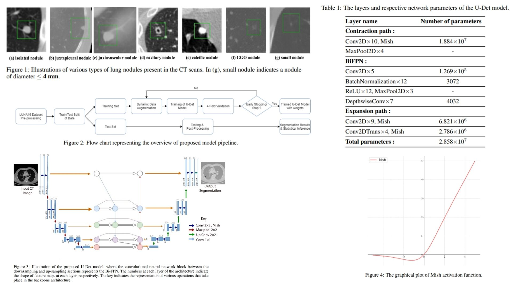

# 🏔 U-Det-Replication — Multi-Scale BiFPN Segmentation

This repository provides a **PyTorch-based replication** of  
**U-Det: A U-Net Enhanced with Bi-FPN for Pulmonary Nodule Segmentation**,  
implemented as a **modular, research-friendly segmentation framework**.

The project translates the paper’s **U-Net backbone, Bi-FPN feature fusion, and progressive decoding**  
into a clean, extendable codebase.

- Enables **high-accuracy nodule segmentation on 2D/3D CT slices** 🫁  
- Implements **multi-scale feature fusion via Bi-FPN blocks** ⚡  
- Incorporates **weighted binary cross-entropy for class imbalance** ✦  
- Designed for **reproducible and efficient inference pipelines** 🜂  

**Paper reference:** [U-Det: Multi-Scale BiFPN for Pulmonary Nodule Segmentation — Author et al., 2023](https://arxiv.org/abs/2003.09293) 📄

---

## 🝆 Overview — Multi-Scale Segmentation Pipeline



> Pulmonary nodules vary widely in **size, density, and shape**, requiring multi-scale reasoning.  

The network learns a mapping:

$$
f_\theta : \mathbb{R}^{H \times W} \rightarrow \mathbb{R}^{H \times W}
$$

where the output is a **segmentation mask** $\hat{Y}$ for a given CT slice $X$.

The architecture combines **U-Net encoding–decoding** with **Bi-FPN for hierarchical feature fusion**,  
enabling robust detection of both small and large nodules.

---

## 🧠 Architectural Principle — U-Det

- **Encoder**: Standard U-Net blocks with progressive downsampling  
- **Bi-FPN**: Multi-scale feature fusion across 5 feature levels  
- **Decoder**: Symmetric upsampling with skip connections  
- **Output**: Single-channel mask with sigmoid activation  

Mathematically, for encoder features $[f_1, ..., f_5]$, Bi-FPN produces fused features:

$$
[F_1, ..., F_5] = \text{BiFPN}([f_1, ..., f_5])
$$

and the decoder reconstructs the mask:

$$
\hat{Y} = \text{Decoder}(F_1, ..., F_5)
$$

---

## 🔬 Loss Function — Weighted Binary Cross-Entropy

To handle class imbalance between nodule and background:

$$
\mathcal{L}_{WBCE} = - \frac{1}{N} \sum_i \big( w \cdot y_i \log(\hat{y}_i) + (1-y_i) \log(1-\hat{y}_i) \big)
$$

where $w$ is the **positive class weight**, $y_i$ is the ground-truth, and $\hat{y}_i$ the predicted probability.

---

## 🩻 Data Handling

- **Dataset**: LUNA-16 CT slices  
- **Augmentation**: Random flip, rotation, elastic noise  
- **Normalization**: Each slice scaled to $[0,1]$  

This improves **training stability** and **model generalization**.

---

## 🧪 What the Model Learns

- Detect **multi-scale nodules** with varying density 🌫️  
- Preserve **edge geometry** through skip connections 🝀  
- Fuse features **across scales** using Bi-FPN ⚡  
- Suppress false positives from vessels and airway structures 🜃  

Segmentation becomes a **context-aware multi-scale reasoning task** rather than a simple pixel-wise classification.

---

## 📦 Repository Structure

```bash
U-Det-Replication/
├── src/
│   ├── model/
│   │   ├── encoders.py           # U-Net encoder blocks
│   │   ├── bifpn.py              # Bi-FPN feature fusion
│   │   ├── decoder.py            # Decoder blocks
│   │   └── udet.py               # Full U-Det assembly
│   │
│   ├── dataset/
│   │   └── luna_loader.py        # LUNA16 slice loader
│   │
│   ├── augmentation/
│   │   └── transforms.py         # Flip, rotate, noise, elastic
│   │
│   ├── pipeline/
│   │   └── inference_pipeline.py # Model inference → mask
│   │
│   ├── loss/
│   │   └── weighted_bce.py       # Weighted BCE loss
│   │
│   ├── utils/
│   │   ├── metrics.py            # Dice, IoU
│   │   └── visualization.py      # Slice + mask overlay
│   │
│   └── config.py                 # Model + training parameters
│
├── images/
│   └── figmix.jpg
│
├── requirements.txt
└── README.md
```
---


## 🔗 Feedback

For questions or feedback, contact: [barkin.adiguzel@gmail.com](mailto:barkin.adiguzel@gmail.com)
